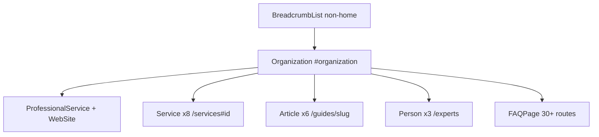

# SEO Architecture — businessvaluationexperts.co.uk

**Canonical domain:** `https://www.businessvaluationexperts.co.uk`  
**Site name:** BusinessValuationExperts  
**Locale:** `en-GB` (UK solicitors, barristers, and law firms)  
**Primary goal:** Rank #1 on Google UK for *business valuation expert witness* and related transactional and informational queries.

This document is the single source of truth for keyword strategy, content clusters, internal linking, structured data, GEO (Generative Engine Optimization), off-page SEO, competitor monitoring, `.co.uk` domain strategy, and launch. All slugs and URLs align with the site build specification.

**Implementation status (summary):** Implemented in this repository via `lib/schema.ts`, `lib/seo/publicUrlInventory.ts`, `lib/seo/clusterLinks.ts`, `lib/seo/glossaryAnchor.ts`, `lib/seo/buildSitemap.ts`, `app/sitemap.ts`, `scripts/verify-seo.ts`, and `scripts/generate-seo.ts`. Keep data layers (`lib/*-data.ts`) and this document in sync when adding routes.

---

## 1. Keyword Strategy

### Editorial rules (site-wide)

- One **primary commercial or informational intent** per URL; avoid competing H1s for the same Tier 1 phrase.
- **Primary keyword** appears in `<title>`, meta description (natural sentence), **H1**, and first screen of body copy where it reads naturally.
- **UK English** spelling and terminology throughout (e.g. *valour* → *valor* only in US contexts if ever added).
- Use **semantic variants** in H2s and internal anchors: share valuation, fair value, S994, CPR Part 35, FPR Part 25, SJE, maintainable earnings, DCF, NAV.
- **E-E-A-T signals:** ACA/FCA/CFA/CVA credentials, CPR Part 35 / FPR Part 25 compliance, *Ikarian Reefer* duties, sector experience, and citeable methodology tables.
- Leverage **`.co.uk`** in copy where natural (trust signal for UK solicitors); see [Section 8](#8-couk-domain-advantage).

### Tier 1 — Transactional

**Target pages:** homepage, `/services` sections, primary `/case-types/[slug]` pages.

| Keyword | Primary URL | Secondary URLs |
|---------|-------------|------------------|
| business valuation expert witness | `/` | `/what-is-a-business-valuation-expert-witness`, `/services` |
| business valuation expert witness UK | `/` | `/qualifications`, `/contact` |
| business valuation expert witness .co.uk | `/` | (brand/domain mention in footer and About copy) |
| share valuation expert witness UK | `/services#share-equity-valuation` | `/case-types/shareholder-dispute-s994`, `/case-types/tax-tribunal-hmrc-valuation` |
| business valuation expert witness divorce | `/services#matrimonial-divorce-valuation` | `/case-types/divorce-financial-remedy`, `/guides/divorce-business-valuation-guide` |
| shareholder dispute valuation expert witness | `/case-types/shareholder-dispute-s994` | `/services#shareholder-dispute-s994`, `/guides/shareholder-disputes-valuation-guide` |
| business valuation expert for court UK | `/what-is-a-business-valuation-expert-witness` | `/qualifications`, `/how-to-instruct` |
| S994 valuation expert witness | `/case-types/shareholder-dispute-s994` | `/glossary#companies-act-2006-s994`, `/glossary#fair-value-s994-context` |
| FPR Part 25 business valuation expert | `/services#matrimonial-divorce-valuation` | `/case-types/divorce-financial-remedy`, `/glossary#fpr-part-25` |
| CPR Part 35 business valuation expert | `/services` (civil services intro) | `/what-is-a-business-valuation-expert-witness`, `/qualifications`, `/glossary#cpr-part-35` |

**Meta title patterns (examples):**

| Page | Title pattern |
|------|---------------|
| `/` | `Business Valuation Expert Witness UK \| Shareholder Disputes & Divorce` |
| `/case-types/shareholder-dispute-s994` | `S994 Shareholder Dispute Valuation Expert Witness UK \| …` |
| `/case-types/divorce-financial-remedy` | `Divorce Business Valuation Expert Witness UK \| FPR Part 25` |

### Tier 2 — Informational

**Target pages:** `/guides/[slug]`, `/valuation-methods`, `/faq`, `/how-to-instruct`, `/fees`, `/what-is-a-business-valuation-expert-witness`.

| Keyword | Primary URL | Secondary URLs |
|---------|-------------|------------------|
| how is a business valued in shareholder dispute UK | `/guides/shareholder-disputes-valuation-guide` | `/case-types/shareholder-dispute-s994`, `/valuation-methods` |
| business valuation methods UK litigation | `/valuation-methods` | `/guides/dcf-maintainable-earnings-expert-guide`, `/faq` |
| DCF vs maintainable earnings UK courts | `/guides/dcf-maintainable-earnings-expert-guide` | `/valuation-methods`, `/glossary#dcf-discounted-cash-flow`, `/glossary#maintainable-earnings` |
| what is fair value S994 petition | `/case-types/shareholder-dispute-s994` | `/glossary#fair-value-s994-context`, `/valuation-methods` |
| single joint expert business valuation UK | `/guides/single-joint-expert-business-valuation` | `/how-to-instruct`, `/glossary#single-joint-expert-sje` |
| FPR Part 25 expert witness business valuation | `/guides/divorce-business-valuation-guide` | `/case-types/divorce-financial-remedy`, `/glossary#fpr-part-25` |
| how to instruct business valuation expert witness UK | `/how-to-instruct` | `/guides/instructing-expert-witness-letter`, `/contact` |
| business valuation expert witness fees UK | `/fees` | `/` (stats table), `/faq` |
| what is personal goodwill in divorce UK | `/case-types/divorce-financial-remedy` | `/glossary#goodwill-personal-vs-business`, `/services#goodwill-intangible` |
| HMRC share valuation dispute expert | `/guides/hmrc-share-valuation-disputes` | `/case-types/tax-tribunal-hmrc-valuation` |

### Tier 3 — Long-tail / sector

**Target pages:** `/sectors/[slug]`, `/case-types/[slug]`.

| Keyword | Primary URL | Notes |
|---------|-------------|-------|
| technology business valuation expert witness UK | `/sectors/technology-saas-digital-businesses` | DCF / ARR focus |
| dental practice valuation expert witness | `/sectors/healthcare-dental-medical` | Fee-income multiples |
| professional practice valuation expert witness UK | `/sectors/professional-practices` | Personal vs transferable goodwill |
| SaaS business valuation expert witness | `/sectors/technology-saas-digital-businesses` | Same sector page; ARR/churn in FAQs |
| manufacturing business valuation expert witness UK | `/sectors/manufacturing-distribution` | EBITDA + NAV hybrid |
| hotel business valuation expert witness UK | `/sectors/retail-hospitality-leisure` | Lease / IFRS 16 content |
| divorce business valuation expert witness London | `/case-types/divorce-financial-remedy` | No dedicated London slug; geo in copy/meta where natural |
| S994 unfair prejudice valuation expert UK | `/case-types/shareholder-dispute-s994` | Fair value standard |
| HMRC share valuation expert witness First-tier Tribunal | `/case-types/tax-tribunal-hmrc-valuation` | Tax Chamber |
| MBO dispute business valuation expert witness | `/case-types/management-buyout-dispute` | Director duties / fair price |

### Keyword → URL implementation reference

| Cluster | URL pattern | Meta source |
|---------|-------------|-------------|
| Brand / transactional | `/` | Page-level `createMetadata()` |
| Services transactional | `/services`, `/services#{fragment}` | `/services` page + section H2s |
| Case-type transactional | `/case-types/{slug}` | `data/case-types.ts` (planned) |
| Sector long-tail | `/sectors/{slug}` | `data/sectors.ts` (planned) |
| Informational | `/guides/{slug}` | `data/guides.ts` (planned) |
| Methodology | `/valuation-methods` | Page-level metadata |
| Utility / process | `/how-to-instruct`, `/fees`, `/faq`, `/qualifications` | Page-level metadata |

---

## 2. Content Cluster Map

Eight topical hubs drive internal linking, anchor text, and content depth. Each hub has a pillar URL and supporting pages.

```mermaid
flowchart TD
  subgraph hub1 [Hub1_ShareholderDisputes]
    H1[S994_and_Shareholder_Disputes]
  end
  subgraph hub2 [Hub2_DivorceMatrimonial]
    H2[FPR_Part_25_Divorce]
  end
  subgraph hub3 [Hub3_ValuationMethods]
    H3[DCF_ME_NAV_Methods]
  end
  subgraph hub4 [Hub4_SingleJointExpert]
    H4[SJE_Process]
  end
  subgraph hub5 [Hub5_HMRC_Tax]
    H5[HMRC_Tax_Tribunal]
  end
  subgraph hub6 [Hub6_SectorSpecialists]
    H6[Sector_Pages]
  end
  subgraph hub7 [Hub7_Insolvency]
    H7[Insolvency_Administration]
  end
  subgraph hub8 [Hub8_InstructionProcess]
    H8[Instruct_Fees_Qualifications]
  end
  H1 --> CT1["/case-types/shareholder-dispute-s994"]
  H1 --> G1["/guides/shareholder-disputes-valuation-guide"]
  H1 --> S1["/services#shareholder-dispute-s994"]
  H1 --> GL1["/glossary#companies-act-2006-s994"]
  H2 --> CT2["/case-types/divorce-financial-remedy"]
  H2 --> G2["/guides/divorce-business-valuation-guide"]
  H2 --> S2["/services#matrimonial-divorce-valuation"]
  H3 --> VM["/valuation-methods"]
  H3 --> G3["/guides/dcf-maintainable-earnings-expert-guide"]
  H4 --> G4["/guides/single-joint-expert-business-valuation"]
  H4 --> HTI["/how-to-instruct"]
  H5 --> CT5["/case-types/tax-tribunal-hmrc-valuation"]
  H5 --> G5["/guides/hmrc-share-valuation-disputes"]
  H6 --> SEC["/sectors/*"]
  H7 --> CT7["/case-types/insolvency-administration"]
  H8 --> HTI2["/how-to-instruct"]
  H8 --> FEES["/fees"]
  H8 --> CONTACT["/contact"]
```



### Hub 1: Shareholder Disputes

| Role | URL |
|------|-----|
| Pillar | `/case-types/shareholder-dispute-s994` |
| Supporting | `/guides/shareholder-disputes-valuation-guide` |
| Service | `/services#shareholder-dispute-s994` |
| Glossary | `/glossary#companies-act-2006-s994`, `/glossary#fair-value-s994-context`, `/glossary#minority-discount` |
| FAQ | `/faq` (S994 Q&As) |

### Hub 2: Divorce & Matrimonial

| Role | URL |
|------|-----|
| Pillar | `/case-types/divorce-financial-remedy` |
| Supporting | `/guides/divorce-business-valuation-guide` |
| Service | `/services#matrimonial-divorce-valuation` |
| Glossary | `/glossary#fpr-part-25`, `/glossary#goodwill-personal-vs-business` |
| FAQ | `/faq` (FPR Q&As) |

### Hub 3: Valuation Methods

| Role | URL |
|------|-----|
| Pillar | `/valuation-methods` |
| Supporting | `/guides/dcf-maintainable-earnings-expert-guide` |
| Glossary | `/glossary#dcf-discounted-cash-flow`, `/glossary#maintainable-earnings`, `/glossary#nav-net-asset-value`, `/glossary#wacc-weighted-average-cost-of-capital` |
| FAQ | `/faq` (methodology Q&As) |

### Hub 4: Single Joint Expert

| Role | URL |
|------|-----|
| Pillar | `/guides/single-joint-expert-business-valuation` |
| Supporting | `/how-to-instruct`, `/what-is-a-business-valuation-expert-witness` |
| Glossary | `/glossary#single-joint-expert-sje`, `/glossary#party-appointed-expert-pae` |
| Cross-ref | All `/case-types/[slug]` (SJE vs PAE where relevant) |
| FAQ | `/faq` (SJE Q&As) |

### Hub 5: HMRC & Tax Disputes

| Role | URL |
|------|-----|
| Pillar | `/case-types/tax-tribunal-hmrc-valuation` |
| Supporting | `/guides/hmrc-share-valuation-disputes` |
| Service | `/services#share-equity-valuation` |
| Sector | `/sectors/financial-services` (cross-link where tax + FS overlap) |
| Glossary | `/glossary` (HMRC-related terms via case-type links) |
| FAQ | `/faq` (HMRC Q&As) |

### Hub 6: Sector Specialists

| Role | URL |
|------|-----|
| Pillar | `/sectors` (hub) |
| Supporting | All 8 `/sectors/[slug]` pages |
| Services | Sector references on `/services` |
| Guides | Sector-specific deep links from guides where applicable |
| Case types | Cross-referenced from sector pages |

### Hub 7: Insolvency

| Role | URL |
|------|-----|
| Pillar | `/case-types/insolvency-administration` |
| Service | `/services#insolvency-administration` |
| Glossary | `/glossary#going-concern-value`, `/glossary#wrongful-trading-s214`, `/glossary#transaction-at-undervalue-s238` |

### Hub 8: Instruction Process

| Role | URL |
|------|-----|
| Pillar | `/how-to-instruct` |
| Supporting | `/guides/instructing-expert-witness-letter`, `/fees`, `/qualifications`, `/contact` |

### Slug inventory (data layer)

**Case types (10):**

| Slug | H1 theme |
|------|----------|
| `shareholder-dispute-s994` | Shareholder Dispute & S994 Petition |
| `divorce-financial-remedy` | Divorce & Financial Remedy |
| `partnership-dissolution` | Partnership Dissolution |
| `commercial-litigation-breach-of-warranty` | Breach of Warranty & M&A Dispute |
| `insolvency-administration` | Insolvency & Administration |
| `tax-tribunal-hmrc-valuation` | HMRC Valuation Dispute & Tax Tribunal |
| `professional-negligence-accountant` | Professional Negligence |
| `intellectual-property-valuation` | Intellectual Property Valuation |
| `management-buyout-dispute` | Management Buyout Dispute |
| `compulsory-purchase-goodwill` | Compulsory Purchase & Goodwill |

**Sectors (8):**

| Slug | H1 theme |
|------|----------|
| `technology-saas-digital-businesses` | Technology & SaaS |
| `professional-practices` | Professional Practices |
| `retail-hospitality-leisure` | Retail, Hospitality & Leisure |
| `property-companies` | Property Companies |
| `manufacturing-distribution` | Manufacturing & Distribution |
| `financial-services` | Financial Services |
| `healthcare-dental-medical` | Healthcare, Dental & Medical |
| `creative-media-ip-businesses` | Creative, Media & IP |

**Guides (6):**

| Slug | H1 theme |
|------|----------|
| `shareholder-disputes-valuation-guide` | S994 Petitions Explained |
| `divorce-business-valuation-guide` | Divorce Proceedings: FPR Part 25 |
| `dcf-maintainable-earnings-expert-guide` | DCF vs Maintainable Earnings |
| `single-joint-expert-business-valuation` | Single Joint Expert Guide |
| `hmrc-share-valuation-disputes` | HMRC Share Valuation Disputes |
| `instructing-expert-witness-letter` | Letter of Instruction |

**Services (8 fragment IDs on `/services`):**

| Fragment ID | Service name |
|-------------|--------------|
| `share-equity-valuation` | Share & Equity Valuation |
| `matrimonial-divorce-valuation` | Matrimonial & Divorce Valuations |
| `shareholder-dispute-s994` | Shareholder Dispute Valuations (S994) |
| `goodwill-intangible` | Goodwill & Intangible Asset Valuation |
| `intellectual-property-valuation` | Intellectual Property Valuation |
| `insolvency-administration` | Insolvency & Administration Valuations |
| `partnership-llp` | Partnership & LLP Valuations |
| `expert-determination` | Expert Determination |

### Glossary anchor ID convention

Generate fragment IDs from term text:

```js
term.toLowerCase().replace(/[^a-z0-9]+/g, "-").replace(/^-|-$/g, "")
```

Full term → anchor mappings: [Appendix C](#appendix-c-glossary-anchor-ids-and-default-links).

---

## 3. Internal Linking Rules

### Rule sets (mandatory)

#### 1. Every `/case-types/[slug]` must link to:

- Relevant `/services` section (fragment URL, e.g. `/services#shareholder-dispute-s994`)
- Relevant `/sectors/[slug]` if applicable (e.g. divorce → professional practices or sector named in case)
- Relevant `/guides/[slug]` where a guide exists for that case type
- `/glossary` (direct anchors to key terms used on the page)
- `/how-to-instruct`
- `/contact`

#### 2. Every `/sectors/[slug]` must link to:

- Relevant `/case-types/[slug]` (e.g. tech sector → shareholder dispute, M&A, HMRC)
- Relevant `/services` section
- `/valuation-methods`
- `/qualifications`
- `/contact`

#### 3. Every `/guides/[slug]` must link to:

- `/guides` hub
- Relevant `/case-types/[slug]`
- Relevant `/sectors/[slug]`
- `/how-to-instruct`
- `/qualifications`
- `/contact`

#### 4. `/valuation-methods` must link to:

- All three method sections internally (DCF, maintainable earnings, NAV)
- Relevant `/case-types` (hub + 2–3 spokes, e.g. S994, divorce, insolvency)
- Relevant `/sectors` (hub + tech, property, manufacturing)
- `/glossary` (DCF, maintainable earnings, NAV, WACC, fair value anchors)
- `/guides/dcf-maintainable-earnings-expert-guide`

#### 5. Homepage must link to:

- All 8 `/services` sections (fragment links)
- `/valuation-methods`
- `/case-types` (hub)
- `/sectors` (hub)
- `/what-is-a-business-valuation-expert-witness`
- `/guides`
- `/faq`
- `/contact`

#### 6. Glossary terms must link to:

- Most relevant `/case-types/[slug]`
- Most relevant `/guides/[slug]`
- Most relevant `/services` section (fragment)
- `/valuation-methods` for methodology terms (DCF, maintainable earnings, NAV, WACC)

### Enforcement guidance

**Recommended data model extension** — add to case-type, sector, and guide records:

```ts
relatedLinks?: { label: string; href: string }[];
```

**Page template requirements:**

- Shared `RelatedLinks` or `ContentClusterNav` component in page shell.
- Breadcrumbs on all non-home pages (`BreadcrumbList` schema + UI).
- Glossary: each term rendered with `id={anchorId}` per Appendix C.
- Anchor text must describe the destination (e.g. *S994 fair value valuation guide*), never *click here*.

### Per-template checklist

| Template | Minimum outbound links |
|----------|------------------------|
| `/case-types/[slug]` | 1× services fragment, 0–1× sector, 0–1× guide, glossary (2+ anchors), `/how-to-instruct`, `/contact` |
| `/sectors/[slug]` | 2× case-types, 1× services, `/valuation-methods`, `/qualifications`, `/contact` |
| `/guides/[slug]` | `/guides`, 1× case-type, 0–1× sector, `/how-to-instruct`, `/qualifications`, `/contact` |
| `/valuation-methods` | 3× method anchors, `/guides/dcf-maintainable-earnings-expert-guide`, case-types hub + spokes, sectors hub, 4+ glossary anchors |
| `/` | 8× services, hubs for case-types/sectors/guides, `/valuation-methods`, `/what-is-a-business-valuation-expert-witness`, `/faq`, `/contact` |
| `/glossary` | Per-term `link` field per Appendix C |

---

## 4. Schema Architecture

### Root entity

```json
{
  "@type": "Organization",
  "@id": "https://www.businessvaluationexperts.co.uk/#organization",
  "name": "BusinessValuationExperts",
  "url": "https://www.businessvaluationexperts.co.uk",
  "email": "contact@businessvaluationexperts.co.uk",
  "addressCountry": "GB",
  "areaServed": "United Kingdom"
}
```

**Planned implementation:** `lib/schema.ts` → `organizationSchema()`; `sameAs` from `lib/constants.ts` (LinkedIn company page).

### Schema graph overview



### Children of Organization

| Type | Count | URL / @id | Notes |
|------|-------|-----------|--------|
| Organization | 1 | `#organization` | Root; referenced by all graphs |
| ProfessionalService | 1 | `/` — `#professional-service` | Homepage `@graph` |
| WebSite + SearchAction | 1 | `/` | Optional `potentialAction` SearchAction |
| Service | 8 | `/services#{fragment}` | `servicesPageGraph()` |
| Article | 6 | `/guides/{slug}` | `articleSchema()` + `about` → Service `@id` |
| Person | 3 | `/experts` | Listing page; no per-expert slugs initially |
| FAQPage | 30+ | See below | `faqSchema()` from page FAQs |
| BreadcrumbList | All non-home | Per-page | `breadcrumbSchema()` |

### Service `@id` values

| Service ID | Fragment URL |
|------------|--------------|
| `share-equity-valuation` | `https://www.businessvaluationexperts.co.uk/services#share-equity-valuation` |
| `matrimonial-divorce-valuation` | `.../services#matrimonial-divorce-valuation` |
| `shareholder-dispute-s994` | `.../services#shareholder-dispute-s994` |
| `goodwill-intangible` | `.../services#goodwill-intangible` |
| `intellectual-property-valuation` | `.../services#intellectual-property-valuation` |
| `insolvency-administration` | `.../services#insolvency-administration` |
| `partnership-llp` | `.../services#partnership-llp` |
| `expert-determination` | `.../services#expert-determination` |

### FAQPage coverage

Emit `FAQPage` JSON-LD on:

| Route | FAQ source |
|-------|------------|
| `/faq` | 12 site-wide Q&As |
| `/glossary` | 30+ terms (definition-first; optional FAQPage from term list) |
| `/case-types/[slug]` | 2 FAQs per case type (×10) |
| `/sectors/[slug]` | 2 FAQs per sector (×8) |
| `/valuation-methods/[slug]` | 2 FAQs per method (×3) |
| `/services/[slug]` | 2 FAQs per service (×8) |

### Article `about` mapping

Live Article schema uses **`lib/guide-about.ts` → `GUIDE_ABOUT_SERVICE` only** (no duplicate field on guide data).

| Guide slug | `about` Service / Org `@id` |
|------------|------------------------------|
| `shareholder-disputes-valuation-guide` | `#shareholder-dispute-s994` |
| `divorce-business-valuation-guide` | `#matrimonial-divorce-valuation` |
| `dcf-maintainable-earnings-expert-guide` | `#share-equity-valuation` |
| `single-joint-expert-business-valuation` | Organization (`#organization`) |
| `hmrc-share-valuation-disputes` | `#share-equity-valuation` |
| `instructing-expert-witness-letter` | Organization (`#organization`) |

### Page → schema template matrix

| Route | JSON-LD types |
|-------|---------------|
| `/` | `@graph`: Organization, ProfessionalService, WebSite (+ SearchAction optional) |
| `/services` | `@graph`: Organization, Service ×8 |
| `/services/[slug]` | Organization, Service (same `@id` as hub fragment), BreadcrumbList, FAQPage |
| `/guides/[slug]` | Organization, Article, BreadcrumbList |
| `/experts` | `@graph`: Organization, Person ×3 |
| `/case-types/[slug]` | Organization, BreadcrumbList, FAQPage |
| `/sectors/[slug]` | Organization, BreadcrumbList, FAQPage |
| `/valuation-methods/[slug]` | Organization, BreadcrumbList, FAQPage |
| `/faq` | Organization, FAQPage, BreadcrumbList |
| `/glossary` | Organization, BreadcrumbList, FAQPage (recommended) |
| `/valuation-methods`, static utility | Organization, BreadcrumbList |
| `/thank-you`, `/privacy`, `/terms` | No rich schema required; robots per Section 9 |

**Render via:** `components/seo/JsonLd.tsx` (or equivalent) on each page.

---

## 5. GEO Optimization Targets

Content structured for AI citation, featured snippets, and answer engines: definition-first paragraphs, citeable tables, numbered steps, sourced statistics.

| # | URL | Required extractable artifact | Format |
|---|-----|------------------------------|--------|
| 1 | `/` | UK fees & framework statistics table | HTML `<table>` with caption; sources in footnote |
| 2 | `/valuation-methods` | DCF methodology table (5 steps) | Table: Step \| Description \| Key Variable |
| 3 | `/valuation-methods` | Maintainable earnings methodology table | Same structure |
| 4 | `/valuation-methods` | NAV methodology table | Same structure |
| 5 | `/valuation-methods` | Fair value vs fair market value comparison | Two-column definition table |
| 6 | `/guides/single-joint-expert-business-valuation` | SJE vs PAE comparison table | Side-by-side roles, duties, cost |
| 7 | `/what-is-a-business-valuation-expert-witness` | CPR Part 35 vs FPR Part 25 comparison | Court, cases, permission rules |
| 8 | `/sectors/*` | Sector multiples reference (dental, tech, professional practices) | Table in sector body + FAQs |
| 9 | `/glossary` | 30+ terms, definition-first | Anchor IDs; one-sentence lead definition per term |
| 10 | `/how-to-instruct` | Step-by-step instruction process | Numbered steps + SJE subprocess |

### GEO content rules

- Lead each major section with a **direct answer** (40–60 words) before depth.
- Tables use semantic `<table>`, `<caption>`, and header row.
- Cite sources where statistics appear (CPR Part 35, FPR Part 25, Expert Evidence International, industry benchmarks).
- Do not hide primary factual content behind accordions only.
- Include **comparison tables** where courts or solicitors choose between options (DCF vs ME, SJE vs PAE, fair value vs FMV).

---

## 6. Off-Page SEO Targets

### Directories (listing submissions)

| Directory | URL | Priority | Target pages to promote |
|-----------|-----|----------|-------------------------|
| UK Register of Expert Witnesses | [jspubs.com](https://www.jspubs.com) | P1 | `/`, `/case-types/*`, `/sectors/*` |
| Academy of Experts | [academyofexperts.org](https://www.academyofexperts.org) | P1 | `/qualifications`, `/how-to-instruct` |
| Expert Witness Institute (EWI) | ewi.org.uk | P1 | `/qualifications`, `/experts` |
| ICAEW Business Valuation Community | ICAEW directory / community | P1 | `/qualifications`, `/services` |
| Resolution | resolution.org.uk (divorce solicitors) | P2 | `/case-types/divorce-financial-remedy`, `/guides/divorce-business-valuation-guide` |
| The Law Society expert finder | Law Society resources | P2 | `/`, `/contact` |
| Lexvisio.com | lexvisio.com/expert-witnesses | P2 | `/`, category: business valuation |

**Tracking template:**

| Directory | Owner | Submitted | Live listing URL | Referral sessions/mo |
|-----------|-------|-----------|------------------|----------------------|
| jspubs.com | | | | |
| Academy of Experts | | | | |
| EWI | | | | |
| ICAEW | | | | |
| Resolution | | | | |
| Law Society | | | | |
| Lexvisio | | | | |

### Publications (citations / guest content)

| Publication | Focus | Outreach angle |
|-------------|-------|----------------|
| Accountancy Age | Business valuation, litigation | Expert witness trends UK |
| ICAEW economia | Chartered accountant experts | CPR Part 35 compliance |
| Practical Law (Thomson Reuters) | Solicitor audience | S994 / M&A valuation |
| Family Law journal | Matrimonial valuations | FPR Part 25, personal goodwill |
| The Company Lawyer | Shareholder disputes | Fair value, S994 |
| Insolvency Intelligence | Insolvency valuations | Going concern vs break-up |

**Outreach KPI template:**

| Publication | Piece title | Published | Backlink URL | Notes |
|-------------|-------------|-----------|--------------|-------|
| | | | | |

### Digital PR angles

| Headline | Primary landing URL | Audience |
|----------|---------------------|----------|
| Business Valuation in UK Shareholder Disputes: What Solicitors Need to Know 2025 | `/guides/shareholder-disputes-valuation-guide` | Chancery / corporate litigators |
| DCF vs Maintainable Earnings: How UK Courts Choose | `/guides/dcf-maintainable-earnings-expert-guide` | All civil litigators |
| FPR Part 25 Changes: Impact on Business Valuations in Divorce | `/guides/divorce-business-valuation-guide` | Family law firms |
| HMRC Share Valuation Disputes on the Rise: 2025 Data | `/guides/hmrc-share-valuation-disputes` | Tax / private client |
| Dental Practice Valuations: 2025 Market Data for Litigation | `/sectors/healthcare-dental-medical` | Family + corporate |

---

## 7. Competitor Monitoring

### Monthly review URLs

| Competitor | URL | What to track |
|------------|-----|---------------|
| Inquesta Forensic | inquestaforensic.co.uk/blog/business-valuation-expert-witness/ | Blog depth, service pages, backlinks |
| Hilton Smythe | hiltonsmythe.com/company-valuation-services/business-valuation-expert-witness/ | Pricing signals, sector coverage |
| RA Valuation Services | ravaluationservices.com/matrimonial-expert-witness-business-valuation/ | Divorce positioning, fees |
| jspubs.com listings | jspubs.com/expert-witness/si/b/business-valuation/ | Directory competitors, profiles |
| Lexvisio | lexvisio.com/expert-witnesses/business-valuation | Listing quality, new entrants |

### Tracking rubric (score 1–5 monthly)

- **Content depth** (word count, methodology tables, FAQs per case type/sector)
- **Backlinks** (referring domains to expert-witness landing pages)
- **Pricing signals** (fees pages, directory rate cards)
- **New case-type or sector pages**
- **Schema / technical SEO** (FAQPage, Article, sitemap freshness)

### Monthly log template

| Month | Competitor | Page reviewed | Depth (1–5) | New content? | Pricing noted | Action for us |
|-------|------------|---------------|-------------|--------------|---------------|---------------|
| | | | | | | |

---

## 8. .co.uk Domain Advantage

`businessvaluationexperts.co.uk` is a **`.co.uk` country-code top-level domain (ccTLD)**. Google treats ccTLDs as strong geographic signals and assigns them implicit geotargeting to the United Kingdom.

### Implications

| Topic | Guidance |
|-------|----------|
| UK geotargeting | No need for `hreflang="en-GB"` alternate URLs for a UK-only site; the ccTLD handles country targeting |
| Keyword advantage | Stronger relevance signals for queries such as *business valuation expert witness UK* than a generic `.com` without hreflang/geotargeting configuration |
| Google Search Console | Verify property for `www` and apex; confirm **Country targeting: United Kingdom** (typically defaults correctly for `.co.uk` — confirm after launch) |
| hreflang | Still include **`x-default`** in root `app/layout.tsx` via `metadata.alternates.languages` pointing to the canonical `https://www.businessvaluationexperts.co.uk/` URL for completeness and future locale expansion |
| Canonical host | Always use `https://www.businessvaluationexperts.co.uk` (apex → www 301 in `middleware.ts`) |
| Copy | Reference UK courts, CPR Part 35, FPR Part 25, Companies Act 2006, and GBP fees — reinforces geo relevance alongside the TLD |

### What not to do

- Do not launch a duplicate `.com` with the same content without proper canonical/hreflang strategy.
- Do not target US-primary keywords on this domain without a deliberate international architecture.

---

## 9. Deployment Checklist

| Task | Implementation | Status |
|------|----------------|--------|
| Vercel deployment | Connect repo; production branch | Pending |
| DNS: `businessvaluationexperts.co.uk` → www | Registrar CNAME/ALIAS + `middleware.ts` apex → www 301 | Pending |
| GSC: UK geotargeting | Confirm United Kingdom in Search Console settings | Pending |
| `NEXT_PUBLIC_SITE_URL` | `https://www.businessvaluationexperts.co.uk` in `.env` / `lib/site.ts` | Pending |
| `NEXT_PUBLIC_FORMSPREE_FORM_ID` | Contact form on `/contact` | Pending |
| `GOOGLE_SITE_VERIFICATION` | `metadata.verification.google` in `app/layout.tsx` | Pending |
| `BING_SITE_VERIFICATION` | Bing meta tag in layout | Pending |
| `NEXT_PUBLIC_GA_MEASUREMENT_ID` | Analytics component in layout | Pending |
| Submit sitemap | GSC + Bing Webmaster after `app/sitemap.ts` deploy | Pending |
| LinkedIn company page | **BusinessValuationExperts** — `sameAs` in Organization schema | Pending |
| Directory submissions | jspubs, Academy of Experts, ICAEW, EWI | Manual post-launch |

### Sitemap priorities

| URL | Priority | changefreq |
|-----|----------|------------|
| `/` | 1.0 | weekly |
| `/services` | 0.95 | monthly |
| `/valuation-methods` | 0.93 | monthly |
| `/case-types` | 0.92 | monthly |
| `/what-is-a-business-valuation-expert-witness` | 0.90 | monthly |
| `/sectors` | 0.90 | monthly |
| `/qualifications`, `/how-to-instruct`, `/fees` | 0.88 | monthly |
| `/faq`, `/guides` | 0.87 | monthly |
| `/case-types/[slug]` | 0.88 | monthly |
| `/sectors/[slug]` | 0.86 | monthly |
| `/guides/[slug]` | 0.80 | monthly |
| `/experts` | 0.80 | monthly |
| `/glossary` | 0.75 | monthly |

**Exclude from sitemap:** `/contact`, `/thank-you`, `/privacy`, `/terms`

### Robots / indexing

| Route | robots |
|-------|--------|
| `/thank-you` | `noindex, nofollow` |
| `/privacy`, `/terms` | `noindex, follow` |
| All other public routes | index, follow |
| Staging / preview hosts | `noindex` via environment check |

### Environment variables (`.env.example`)

```env
NEXT_PUBLIC_FORMSPREE_FORM_ID=
NEXT_PUBLIC_SITE_URL=https://www.businessvaluationexperts.co.uk
NEXT_PUBLIC_GA_MEASUREMENT_ID=
GOOGLE_SITE_VERIFICATION=
BING_SITE_VERIFICATION=
```

---

## Appendix A: Full URL Inventory

**Total sitemap paths:** 48 (13 static hubs + 8 services + 3 valuation methods + 10 case-types + 8 sectors + 6 guides).

**Excluded from sitemap but routable:** `/contact`, `/thank-you`, `/privacy`, `/terms`, `/cookies`.

### Static & hub pages (13 in sitemap)

| URL | Sitemap priority | Index? |
|-----|------------------|--------|
| `/` | 1.0 | Yes |
| `/what-is-a-business-valuation-expert-witness` | 0.90 | Yes |
| `/services` | 0.95 | Yes |
| `/valuation-methods` | 0.93 | Yes |
| `/case-types` | 0.92 | Yes |
| `/sectors` | 0.90 | Yes |
| `/qualifications` | 0.88 | Yes |
| `/how-to-instruct` | 0.88 | Yes |
| `/fees` | 0.88 | Yes |
| `/faq` | 0.87 | Yes |
| `/guides` | 0.87 | Yes |
| `/experts` | 0.80 | Yes |
| `/glossary` | 0.75 | Yes |
| `/contact` | — | Yes (excluded from sitemap) |
| `/thank-you` | — | noindex |
| `/privacy` | — | noindex |
| `/terms` | — | noindex |
| `/cookies` | — | noindex |

### Dynamic pages (35 in sitemap)

| Pattern | Count | Priority |
|---------|-------|----------|
| `/services/{slug}` | 8 | 0.85 |
| `/valuation-methods/{slug}` | 3 | 0.80 |
| `/case-types/{slug}` | 10 | 0.88 |
| `/sectors/{slug}` | 8 | 0.86 |
| `/guides/{slug}` | 6 | 0.80 |

Service fragment IDs on `/services#{anchor}` remain the canonical Service schema `@id` (detail pages reuse the same `@id`).

---

## Appendix B: Keyword → URL Matrix (All 30)

| # | Keyword | Tier | Primary URL |
|---|---------|------|-------------|
| 1 | business valuation expert witness | 1 | `/` |
| 2 | business valuation expert witness UK | 1 | `/` |
| 3 | business valuation expert witness .co.uk | 1 | `/` |
| 4 | share valuation expert witness UK | 1 | `/services#share-equity-valuation` |
| 5 | business valuation expert witness divorce | 1 | `/services#matrimonial-divorce-valuation` |
| 6 | shareholder dispute valuation expert witness | 1 | `/case-types/shareholder-dispute-s994` |
| 7 | business valuation expert for court UK | 1 | `/what-is-a-business-valuation-expert-witness` |
| 8 | S994 valuation expert witness | 1 | `/case-types/shareholder-dispute-s994` |
| 9 | FPR Part 25 business valuation expert | 1 | `/services#matrimonial-divorce-valuation` |
| 10 | CPR Part 35 business valuation expert | 1 | `/services` |
| 11 | how is a business valued in shareholder dispute UK | 2 | `/guides/shareholder-disputes-valuation-guide` |
| 12 | business valuation methods UK litigation | 2 | `/valuation-methods` |
| 13 | DCF vs maintainable earnings UK courts | 2 | `/guides/dcf-maintainable-earnings-expert-guide` |
| 14 | what is fair value S994 petition | 2 | `/case-types/shareholder-dispute-s994` |
| 15 | single joint expert business valuation UK | 2 | `/guides/single-joint-expert-business-valuation` |
| 16 | FPR Part 25 expert witness business valuation | 2 | `/guides/divorce-business-valuation-guide` |
| 17 | how to instruct business valuation expert witness UK | 2 | `/how-to-instruct` |
| 18 | business valuation expert witness fees UK | 2 | `/fees` |
| 19 | what is personal goodwill in divorce UK | 2 | `/case-types/divorce-financial-remedy` |
| 20 | HMRC share valuation dispute expert | 2 | `/guides/hmrc-share-valuation-disputes` |
| 21 | technology business valuation expert witness UK | 3 | `/sectors/technology-saas-digital-businesses` |
| 22 | dental practice valuation expert witness | 3 | `/sectors/healthcare-dental-medical` |
| 23 | professional practice valuation expert witness UK | 3 | `/sectors/professional-practices` |
| 24 | SaaS business valuation expert witness | 3 | `/sectors/technology-saas-digital-businesses` |
| 25 | manufacturing business valuation expert witness UK | 3 | `/sectors/manufacturing-distribution` |
| 26 | hotel business valuation expert witness UK | 3 | `/sectors/retail-hospitality-leisure` |
| 27 | divorce business valuation expert witness London | 3 | `/case-types/divorce-financial-remedy` |
| 28 | S994 unfair prejudice valuation expert UK | 3 | `/case-types/shareholder-dispute-s994` |
| 29 | HMRC share valuation expert witness First-tier Tribunal | 3 | `/case-types/tax-tribunal-hmrc-valuation` |
| 30 | MBO dispute business valuation expert witness | 3 | `/case-types/management-buyout-dispute` |

---

## Appendix C: Glossary Anchor IDs and Default Links

| # | Term | Anchor ID | Default link |
|---|------|-----------|--------------|
| 1 | Adjusted EBITDA | `adjusted-ebitda` | `/valuation-methods` |
| 2 | But-For Value | `but-for-value` | `/case-types/professional-negligence-accountant` |
| 3 | Capitalisation Rate | `capitalisation-rate` | `/valuation-methods` |
| 4 | Companies Act 2006 S994 | `companies-act-2006-s994` | `/case-types/shareholder-dispute-s994` |
| 5 | Control Premium | `control-premium` | `/valuation-methods` |
| 6 | CPR Part 35 | `cpr-part-35` | `/qualifications` |
| 7 | DCF (Discounted Cash Flow) | `dcf-discounted-cash-flow` | `/valuation-methods` |
| 8 | Diminution in Value | `diminution-in-value` | `/case-types/commercial-litigation-breach-of-warranty` |
| 9 | DLOM (Discount for Lack of Marketability) | `dlom-discount-for-lack-of-marketability` | `/valuation-methods` |
| 10 | EBITDA | `ebitda` | `/valuation-methods` |
| 11 | Enterprise Value | `enterprise-value` | `/valuation-methods` |
| 12 | Expert Determination | `expert-determination` | `/services#expert-determination` |
| 13 | Fair Market Value | `fair-market-value` | `/valuation-methods` |
| 14 | Fair Value (S994 context) | `fair-value-s994-context` | `/case-types/shareholder-dispute-s994` |
| 15 | FPR Part 25 | `fpr-part-25` | `/qualifications` |
| 16 | Going Concern Value | `going-concern-value` | `/case-types/insolvency-administration` |
| 17 | Goodwill (Personal vs Business) | `goodwill-personal-vs-business` | `/services#goodwill-intangible` |
| 18 | The Ikarian Reefer Duties | `the-ikarian-reefer-duties` | `/qualifications` |
| 19 | Intangible Assets | `intangible-assets` | `/services#goodwill-intangible` |
| 20 | Maintainable Earnings | `maintainable-earnings` | `/valuation-methods` |
| 21 | Minority Discount | `minority-discount` | `/case-types/shareholder-dispute-s994` |
| 22 | NAV (Net Asset Value) | `nav-net-asset-value` | `/valuation-methods` |
| 23 | Normalisation Adjustments | `normalisation-adjustments` | `/valuation-methods` |
| 24 | Party-Appointed Expert (PAE) | `party-appointed-expert-pae` | `/guides/single-joint-expert-business-valuation` |
| 25 | Professional Indemnity Insurance | `professional-indemnity-insurance` | `/qualifications` |
| 26 | Single Joint Expert (SJE) | `single-joint-expert-sje` | `/guides/single-joint-expert-business-valuation` |
| 27 | Terminal Value | `terminal-value` | `/valuation-methods` |
| 28 | Transaction at Undervalue (S238) | `transaction-at-undervalue-s238` | `/case-types/insolvency-administration` |
| 29 | WACC (Weighted Average Cost of Capital) | `wacc-weighted-average-cost-of-capital` | `/valuation-methods` |
| 30 | Wrongful Trading (S214) | `wrongful-trading-s214` | `/case-types/insolvency-administration` |

**Cluster doc shorthand → canonical ID:**

| Shorthand in hubs | Canonical anchor |
|-------------------|------------------|
| `#s994` | `companies-act-2006-s994` |
| `#fair-value` | `fair-value-s994-context` |
| `#minority-discount` | `minority-discount` |
| `#fpr-part-25` | `fpr-part-25` |
| `#personal-goodwill` | `goodwill-personal-vs-business` |
| `#dcf` | `dcf-discounted-cash-flow` |
| `#maintainable-earnings` | `maintainable-earnings` |
| `#nav` | `nav-net-asset-value` |
| `#wacc` | `wacc-weighted-average-cost-of-capital` |
| `#sje` | `single-joint-expert-sje` |
| `#going-concern` | `going-concern-value` |
| `#wrongful-trading` | `wrongful-trading-s214` |
| `#transaction-at-undervalue` | `transaction-at-undervalue-s238` |

---

## Appendix D: Implementation Status Matrix

| Route / asset | Page built | Metadata | Internal links | JSON-LD | GEO asset |
|---------------|------------|----------|----------------|---------|-----------|
| `/` | Yes | Yes | Yes | Yes | Yes (fees table) |
| `/what-is-a-business-valuation-expert-witness` | Yes | Yes | Yes | Yes | Yes (CPR vs FPR table) |
| `/services` | Yes | Yes | Yes | Yes | Yes (method tables per service) |
| `/valuation-methods` | Yes | Yes | Yes | Yes | Yes (method + FMV tables) |
| `/case-types` + 10 slugs | Yes | Yes | Yes | Yes | Yes (FAQs) |
| `/sectors` + 8 slugs | Yes | Yes | Yes | Yes | Yes (sector multiples on all 8) |
| `/guides` + 6 slugs | Yes | Yes | Yes | Yes | Yes (SJE table on guide 4) |
| `/how-to-instruct` | Yes | Yes | Partial | Yes | Yes (steps) |
| `/fees` | Yes | Yes | Yes | Yes | Yes |
| `/faq` | Yes | Yes | Yes | Yes | Yes |
| `/qualifications` | Yes | Yes | Yes | Yes | — |
| `/experts` | Yes | Yes | — | Yes | — |
| `/glossary` | Yes | Yes | Per-term links | Yes | Yes (30 terms) |
| `/contact` | Yes | Yes | — | — | N/A |
| `app/sitemap.ts` | Yes | — | — | — | — |
| `app/robots.ts` | Yes | — | — | — | — |
| `lib/schema.ts` | Yes | — | — | — | — |
| `lib/seo/publicUrlInventory.ts` | Yes | — | — | — | — |
| `middleware.ts` (apex → www) | Yes | — | — | — | — |
| hreflang `x-default` in layout | Yes | — | — | — | — |

---

## Appendix E: Sitemap and `publicUrlInventory` Sync

When the Next.js site is implemented:

1. Add `lib/seo/publicUrlInventory.ts` that assembles all paths from [Appendix A](#appendix-a-full-url-inventory) (mirror pattern in `accounting-witness/lib/seo/publicUrlInventory.ts`).
2. Generate `app/sitemap.ts` from the inventory with priorities from [Section 9](#9-deployment-checklist).
3. Add `npm run seo:verify` script that fails CI if `app/` routes drift from the inventory.
4. After any slug add/remove, update this document, `data/*.ts`, inventory, and sitemap in the same PR.

**Canonical origin for all absolute URLs:**

```
https://www.businessvaluationexperts.co.uk
```

---

*Last updated: May 2025 — aligns with businessvaluationexperts.co.uk build specification.*
